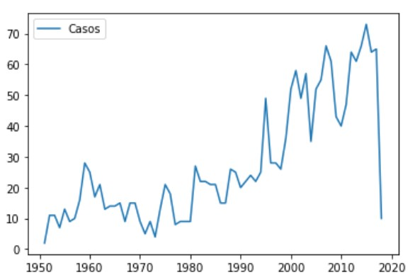
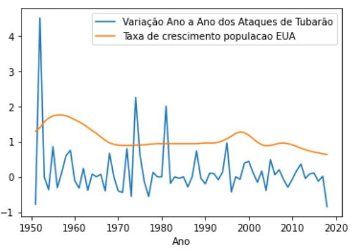
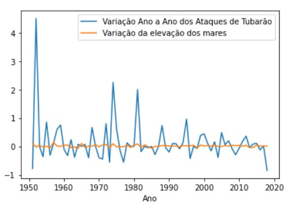
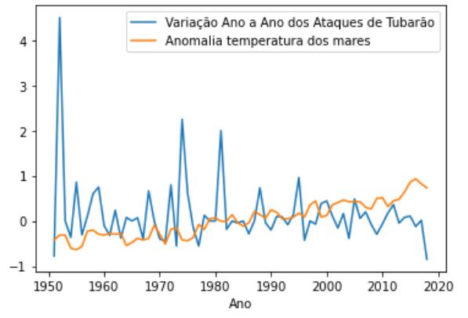

# Ataques de Tubarão nos Estados Unidos da America
## Introdução

Ataques de tubarão são fatos marcantes e recorrentes, que assustam muitas pessoas, seja por influência do filme “Tubarão“ lançado em 1975 do diretor de cinema Steven Spielberg, seja por notícias nos meios de comunicação. O presente estudo tem como objetivo buscar uma possível relação de causa e consequência para justificar o aumento no número de ataques de tubarão nos Estados Unidos com o passar dos anos a partir do ano de 1950, como apresentado no dataset encontrado no [site](https://www.kaggle.com/teajay/global-shark-attacks) e ilustrado no gráfico a seguir:

## Desenvolvimento
A partir disso, avaliou-se três diferentes parâmetros a partir de datasets buscados na internet. O primeiro parâmetro avaliado foi a taxa de [crescimento da população dos Estados Unidos](https://countrymeters.info/pt/United_States_of_America_(USA)), visto que apesar da população nascida entre os anos não será a população que será atacada num intervalo curto de um ano, a tendência do crescimento populacional aumenta a probabilidade de ocorrência de ataques  ao longo dos anos. Comparando-a com a taxa de ataques de tubarão nos EUA, e sendo assim observou-se os seguintes gráficos:

O segundo parâmetro observado foi a variação ano a ano da [elevação dos níveis dos mares](https://www.epa.gov/climate-indicators/climate-change-indicators-sea-level), influenciada pelo aquecimento global, este é um problema recorrente em todo o mundo e por esse motivo a elevação dos níveis dos mares pode influenciar na dispersão das correntes e alterar as rotas naturais dos animais. Analisando-a com a taxa de crescimento de ataques, obtemos o seguinte gráfico:

Por fim, o último parâmetro avaliado foi a [anomalia da temperatura dos mares](https://www.epa.gov/climate-indicators/climate-change-indicators-sea-level), assim como o nível do mar, esta é diretamente relacionada ao aquecimento global e suas consequências supracitadas, e obteve-se o seguinte gráfico:

## Conclusão

A partir das análises realizadas, apesar das limitações do estudo é possível observar que a taxa de crescimento de ataques de tubarão, mesmo que essa variando com bastante amplitude, possui uma correlação do seu valor médio com a variação da elevação dos níveis do mar e com a anomalia na temperatura dos mares, sendo assim possível propor um estudo mais aprofundado e mais assertivo sobre esses fatores. Já para taxa de crescimento da populção dos EUA, apesar de apresentarem uma tendência parecisa, a diferentes níveis, é difícil relaciona-la com a taxa de crescimento de ataques.   
